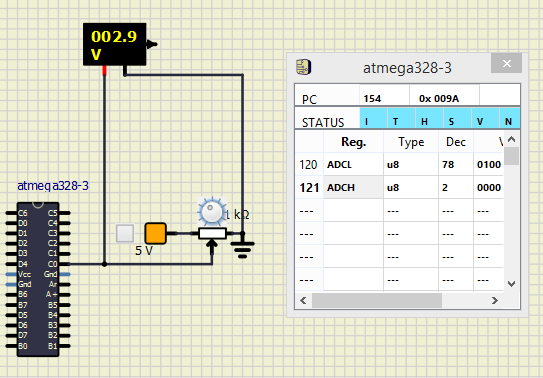

<h1>Project is designed in such a way that if a person is seated on a automotive vehicle, he/she can control the temprature of the seat</h1>

<h1>Activity_1</h1>

<h1>LED Blinking for Two Sensing Input</h1>

<h2>Action</h2>

|ON|OFF|
|:--:|:--:|
|||

<h1>Activity_2</h1>

<h1>ADC</h1>

<h2>Action</h2>

|ADC|
|:--:|
||

<h1>Activity_3</h1>

<h1>Pulse Width Modulation with Timer</h1>

<h2>Action</h2>

|Timer_PWM|
|:--:|
||

<h1>Activity_4</h1>

<h1>USART</h1>

<h2>Action</h2>

|USART|
|:--:|
||

<h3>CI and Code Quality</h3>

|Build|Cppcheck|Codacy|
|:--:|:--:|:--:|
||||
