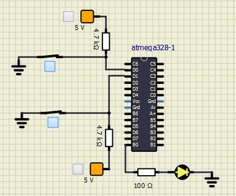
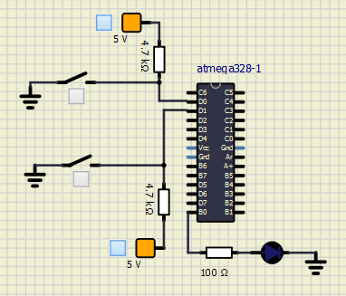

# Activity_1
# LED Blinking for Two Sensing Input
## In Action
|ON|OFF|
|:--:|:--:|
|||
# Activity_2
# ADC
## In Action
|ADC|
|:--:|
||

#### CI and Code Quality

|Build|Cppcheck|Codacy|
|:--:|:--:|:--:|
||||
