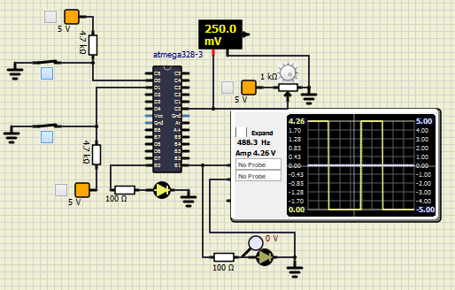

<h1>Activity</h1>

<h1>Pulse Width Modulation with Timer</h1>

<h2>Action</h2>

|Timer_PWM|
|:--:|
||

```
  void Timer_PWM(){

    TCCR1A|=(1<<COM1A1)|(1<<WGM11)|(WGM10); // Timer1 with fast PWM mode
    TCCR1B|=(1<<WGM12)|(1<<CS11)|(1<<CS10);  // prescalar 64
    DDRB|=(1<<PB1);
  }
  char pwmout(uint16_t temp)
  {
    char temperature;

    if((temp>=0) && (temp<=209)){

        OCR1A = 205; //20% duty cycle
        temperature= 20;
        _delay_ms(20);
    }
    else if((temp>=210) && (temp<=509)){

        OCR1A = 410; //40% duty cycle
        temperature = 25;
        _delay_ms(20);
    }
    else if((temp>=510) && (temp<=709)){

        OCR1A = 717;//70% duty cycle
        temperature = 29;
        _delay_ms(20);
    }
    else if((temp>=710) && (temp<=1024)){

        OCR1A = 973; //95% duty cycle
        temperature = 33;
        _delay_ms(20);
    }
    else{
        OCR1A = 0; //0% output
        temperature = 0;
    }
```
