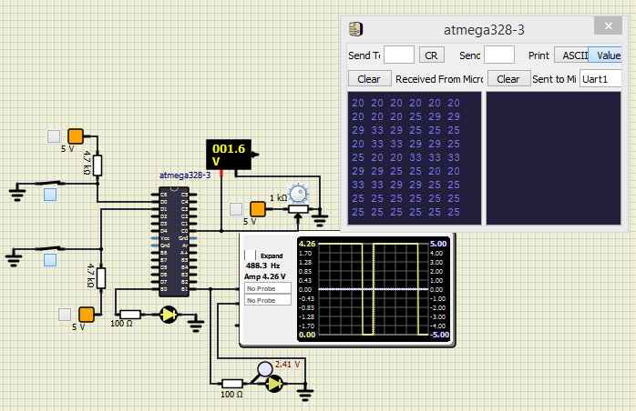

<h1>Activity_4</h1>

<h1>USART</h1>
    
<h2>Action</h2>
    
|USART|
|:--:|
||

<h2>Code</h2>

  void initUSART(uint16_t ubrreg_value){
   
    UBRR0L = ubrreg_value;
    UBRR0H = (ubrreg_value>>8)&(0x00ff);
    UCSR0C = (1<<UMSEL00)|(1<<UCSZ01)|(1<<UCSZ01);
    UCSR0B = (1<<RXEN0)|(1<<TXEN0)|(1<<RXCIE0)|(1<<TXCIE0);

  }
  void UARTsend(char temp_value){
  
    UDR0 = temp_value;
  }

